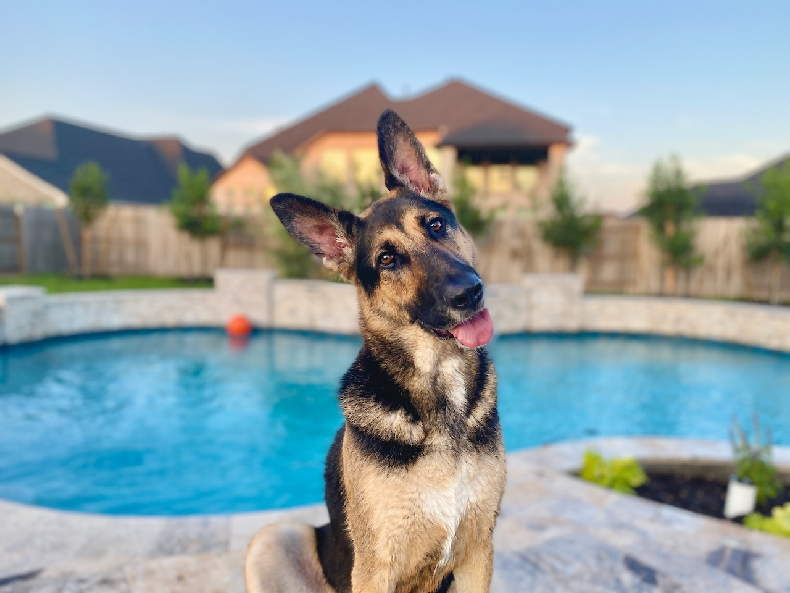
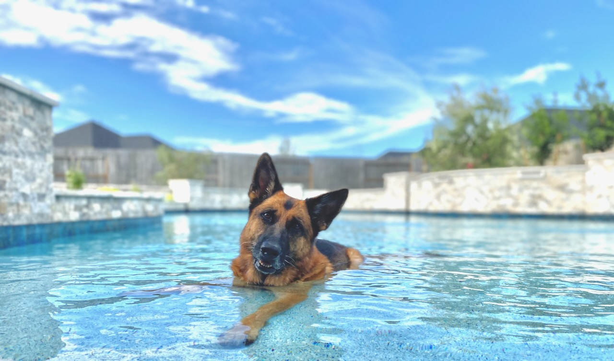

># All about you #

>Here's a place where you can include any details about yourself that you might want to share. Make sure to put your name somewhere so we can connect this PR back to your resume.

>Got a cool web app you've built? Link us to it.

>Got a Hacker News account full of snarky/insightful comments? Rad. We want to read those snarky/insightful comments.

>Got a GitHub account? We'll probably actually figure that out from the pull request. Don't worry about that one.

-------------------------------------------

## About me ##

I'm the kind of person who clearly spends way too much time tinkering with things. To be honest, this assignment was pretty fun, because I haven't touched ExpressJS or React in about four years, and it was great practice to build and deploy this - I learned a ton. And that really describes me. I LOVE to learn and be challenged.

My current passion project has involved learning PHP to get our dog rescue website moved over to WordPress from Joomla, to make it easier for our volunteers to update things. I wrote a fun recursive function that reaches out to our software and grabs dogs, their stats, and photos, then creates/updates posts.

I'm trying to do this on `init`, but am troubleshooting my way through this awful "WordPress has encountered a critical error" message, that basically crashes the site when it happens. I'm so close! Feel free to check it out - be warned, it's still very much under development:  https://dev.ghgsdr.org/dogs-category/available/

It started out with writing [this](https://www.ghgsdr.org/adopt/available-gsds) really quickly in EmberJS over one weekend, and everyone liked that dogs' info updated on the website as soon as we updated them in the software, so they agreed it was time for an update!

I do it all because of our adorable, wonderful girls we adopted from this rescue:

### Olive ###

### Portia ###

### I've got some cool projects ###

- [The Current Rescue Site Repo](https://github.com/kathrynherod/ghgsdr-adoptable-dogs)
- [Started working on MIT's Structure and Interpretation of Computer Programs exercises in LISP - that was different](https://github.com/kathrynherod/sicp_exercises/blob/main/chapter1.md)

##### A way for people to visualize different typography on a website ######
- Site: https://color-typography-visualizer.herokuapp.com/
- Repo: https://github.com/kathrynherod/colorTheme-and-typography-visualizer

##### Quick SPA Prototype for a POS feature at OReilly ######
- Site: https://military-discount-override.herokuapp.com/military
- Repo: https://github.com/kathrynherod/militaryDiscountOverridePreference

When I'm not fostering dogs, doing events for the rescue, or working on the rescue website, I enjoy woodworking and painting (on canvases). We just moved into a new house and I'm currently working on building a Murphy Bed. Oh, and I play French Horn for a local symphony!

Thanks for taking a look at my stuff. In case you need it, here's my [resumé.](https://docs.google.com/document/d/1Py81W4C4hrtCWaypmM0gmuDAzXJF4YpI/edit?usp=sharing&ouid=101872476462081452323&rtpof=true&sd=true)